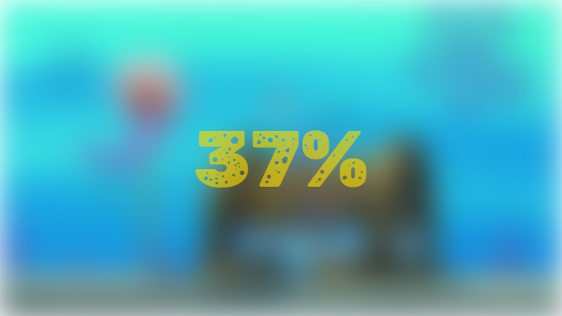
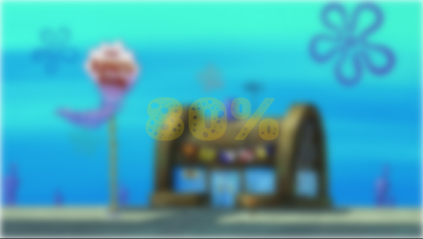
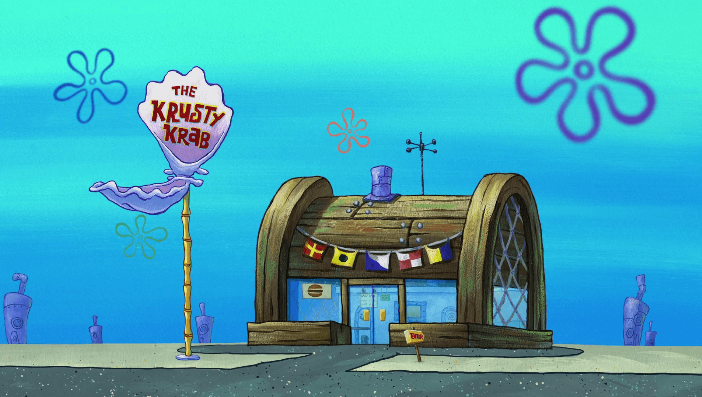

# 🌀 Animated Loading Screen

A simple and elegant **blurred loading screen** animation that smoothly transitions into the main content.
Built using **HTML**, **CSS**, and **JavaScript**.

---

## ✨ Features

* Blurred background effect on load
* Smooth fade-in reveal transition
* Lightweight and responsive design
* Easy to customize (colors, blur intensity, duration)

---

## 🚀 Preview

<p align="center">
  
  
  

</p>

---

## 🛠️ Technologies Used

* **HTML5** for structure
* **CSS3** (animations, blur, transitions)
* **JavaScript** for timing and interactivity

---

## 📦 Setup

```bash
# Clone the repository
git clone https://github.com/yigitkagankartal/loadingScreen.git
